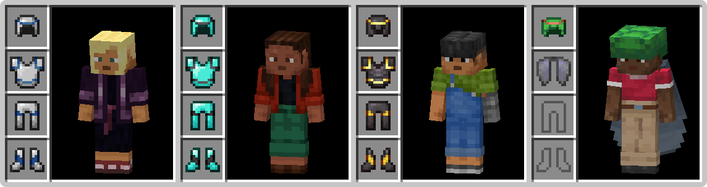

# Invisible Armor Model

## 📥 Download
### Java Edition:

### Bedrock Edition:

## 🗒️ Description
"Invisible Armor Model" is a resource pack for Minecraft Java and Bedrock Edition that removes the visual model of armor. This includes every vanilla armor, except the Elytra and the Turtle Shell. Unfortunately, Armor Trims on Turtle Shells will also be invisible due to their texture being invisible. Keep in mind that other players may still be able to see armors as usual since resource packs are client-side.

## ✨ Features
- Removing the visual model of armor in third person.
- Keeping the visual appearance of Elytras and the Turtle Shell.

## 📷 Gallery

