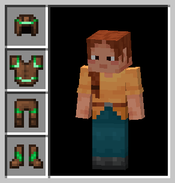
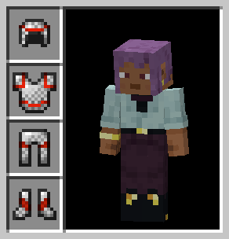
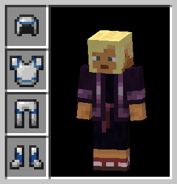
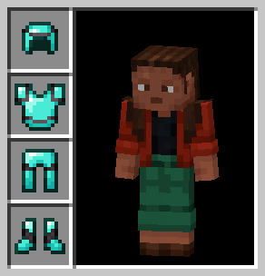

## 📥 Download
### Java Edition

### Bedrock Edition

  
## 🗒️ Description
Any armor model (except the Turtle Shell and the Elytra) is **invisible** in third person. This is especially handy if you don't want to see an armor model on other players or yourself. When using it with other players in co-op, there could be complications as the other players can see your armor, as well as theirs. But you can't. I wouldn't recommend it for competitive games, because you would be at a big **disadvantage** against other players.

Note: Armor Trims are invisible on Turtle Shells due to their texture being invisible!
  
## 📷 Gallery

  
##

This repository is mainly used for navigation and issue tracking.

